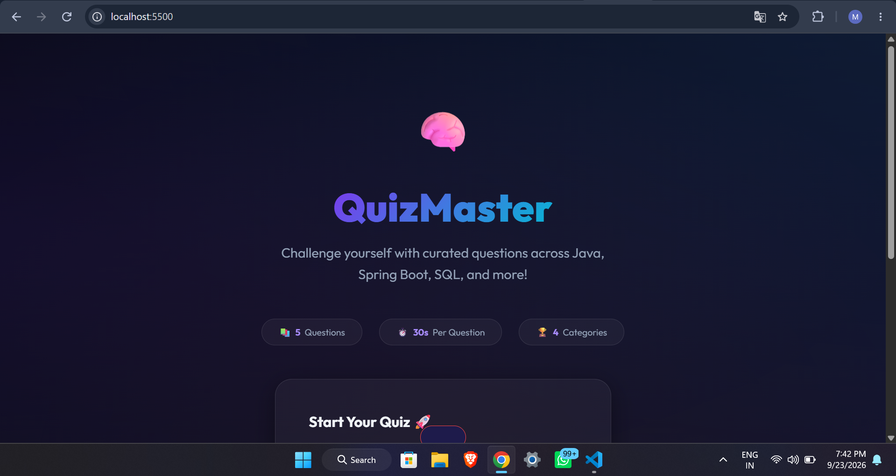
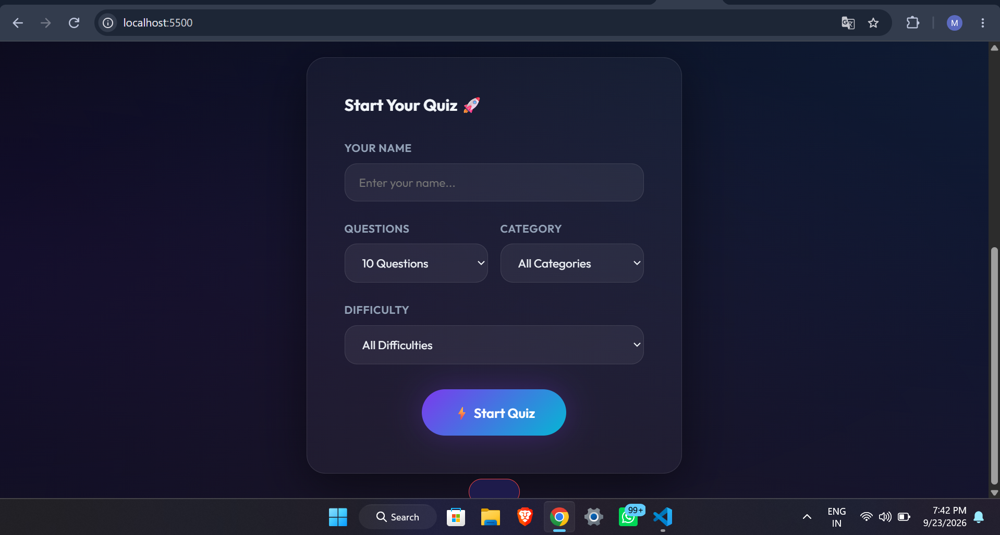
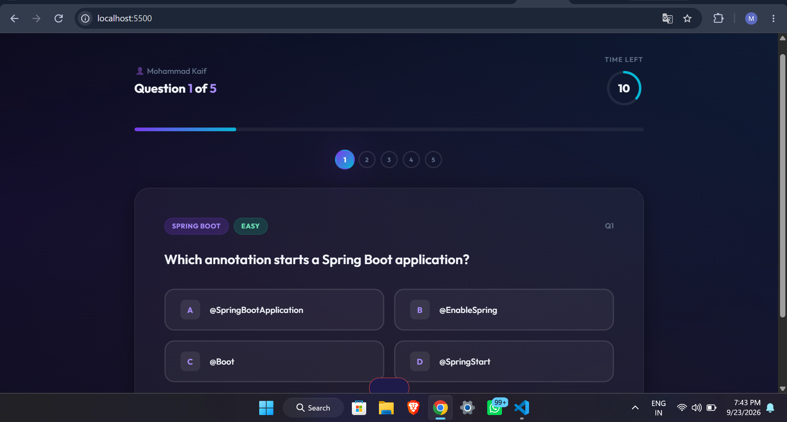
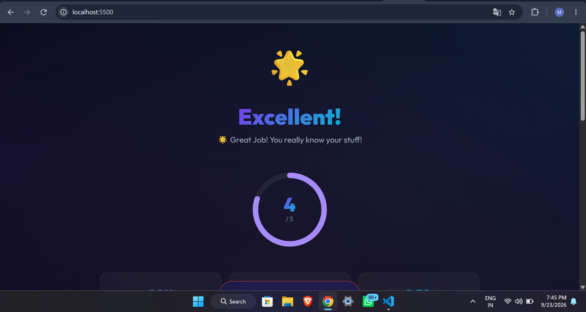
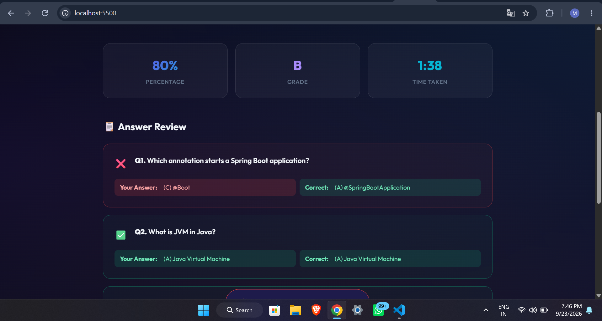
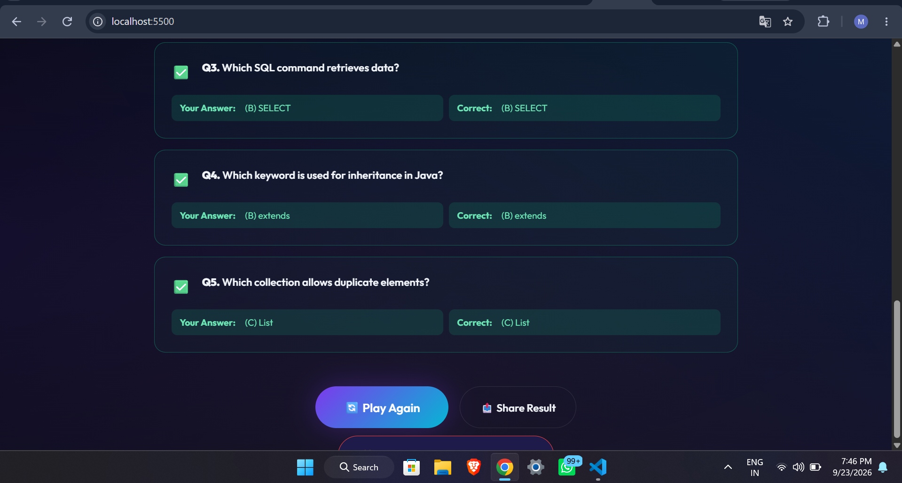

# QuizMaster – Online Quiz Platform

A full-stack online quiz application built with **Java, Spring Boot, PostgreSQL, HTML, CSS, and JavaScript**.  
It allows users to take timed quizzes, select categories and difficulty levels, and view detailed results with answer reviews.

## 🚀 Features

- Timed multiple-choice quizzes
- Select number of questions, category, and difficulty
- 30-second timer per question
- Dynamic question loading from PostgreSQL
- Automatic score calculation
- Percentage and grade calculation
- Detailed answer review
- Quiz attempt tracking
- Responsive and modern UI
- REST APIs using Spring Boot

## 🛠️ Tech Stack

**Frontend**
- HTML5
- CSS3
- JavaScript

**Backend**
- Java
- Spring Boot
- Spring Data JPA
- REST APIs
- Maven

**Database**
- PostgreSQL

## 📸 Screenshots

### Home

### Quiz Setup

### Quiz

### Result

### Answer Review

